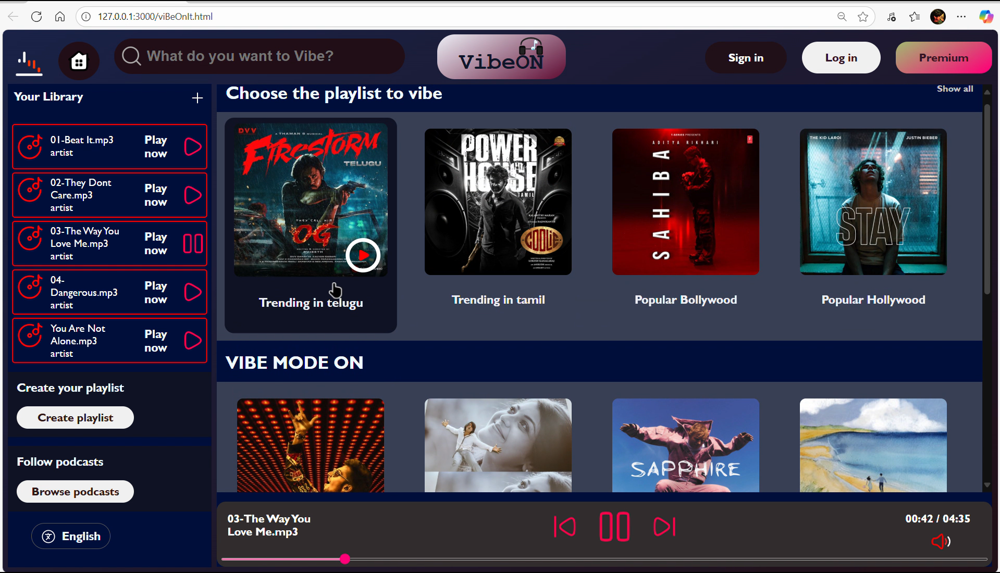
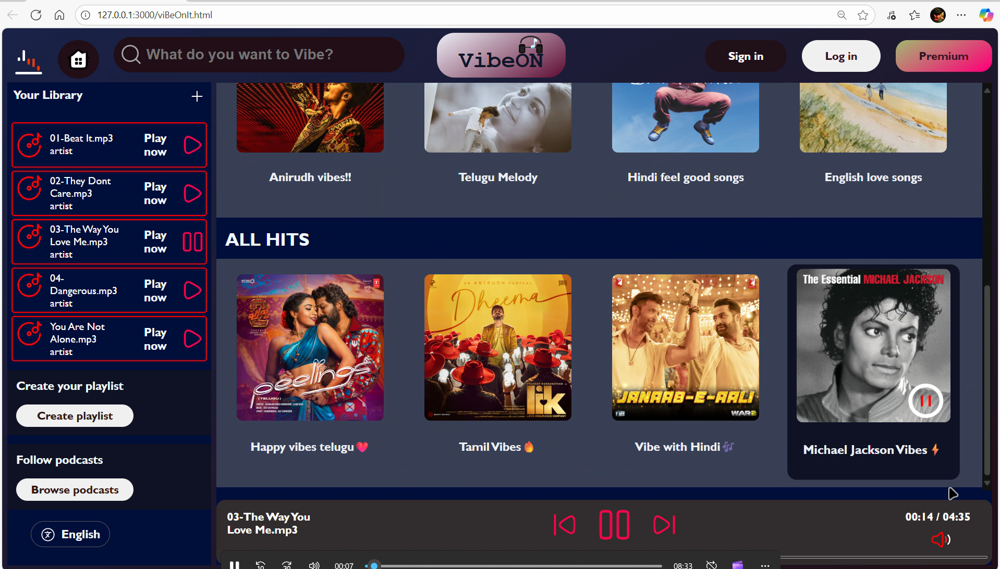

# 🎶 VibeON-Musical 

VibeON is a simple yet elegant **music web application** built using **HTML, CSS, and JavaScript**.  
It allows users to explore, play, and enjoy trending songs in a clean and interactive interface.  

---

## 🚀 Live Demo  
🔗 [Click here to try VibeON](https://your-username.github.io/VibeON/)  

---

## 📸 Preview  

  
  

---

## 🛠️ Features  
- 🎵 Play/Pause functionality  
- 🎚️ Volume control  
- 🎨 Stylish and responsive UI  
- 💾 Saves last played album/session  
- ⚡ Smooth transitions and interactions  

---

## 🏗️ Built With  
- **HTML5** – Structure  
- **CSS3** – Styling & Animations  
- **JavaScript (ES6)** – Interactivity  

---

